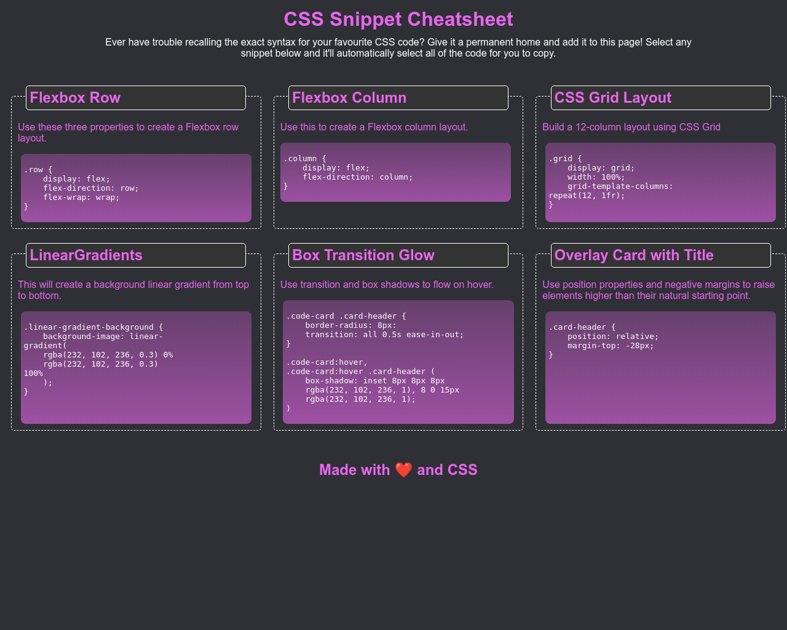

A CSS Cheatsheet made from scratch in HTML and CSS
# Bootcamp Mini Project 2 - CSS Cheatsheet

## Description 

This project was created using HTML and CSS to make a CSS Cheatsheet without starting code. There was the following requirements:

* Must use semantic HTML elements and proper indentation.
* Use CSS variables to maintain clean and reusable values for a color scheme.
* Use flexbox and media queries to create a responsive grid layout.
* Each CSS snippet should have a card-like layout with the CSS syntax wrapped in an [HTML pre element](https://developer.mozilla.org/en-US/docs/Web/HTML/Element/pre).
* Each CSS snippet can easily be highlighted for copying on click using the [CSS user-select property](https://developer.mozilla.org/en-US/docs/Web/CSS/user-select).
* Must incorporate a background color using a [CSS linear-gradient function](https://developer.mozilla.org/en-US/docs/Web/CSS/linear-gradient).
* Must incorporate a bit of animation using the [CSS transition property](https://developer.mozilla.org/en-US/docs/Web/CSS/transition).
* You and your group can decide which CSS styles and colors you will use to design the application, but the app needs to be a responsive. Use the following images to gain an understanding of how the app should look at different screen sizes, from a layout perspective:
  * At size 992px and above there should be three columns.
  * At size 768px and above there should be two columns.
  * On mobile devices, anything under 768px, the app should have one column:

The page in this repo is the result.

## Installation

The site does not require installation steps.

## Usage 

The website can be viewed at [https://bowseruk.github.io/bootcamp-mini-project2/](https://bowseruk.github.io/bootcamp-mini-project2/) with Google Chrome. The source can be viewed in Chrome by right clicking and selecting inspect.

## Credits

This site was based on a project by edX Boot Camps LLC.

[W3School](https://www.w3schools.com/) was used as a reference for elements to use and good practice.

The changes were checked with [W3C Validator](https://validator.w3.org/).

## License

This project uses the licence in the LICENCE file of the repo.